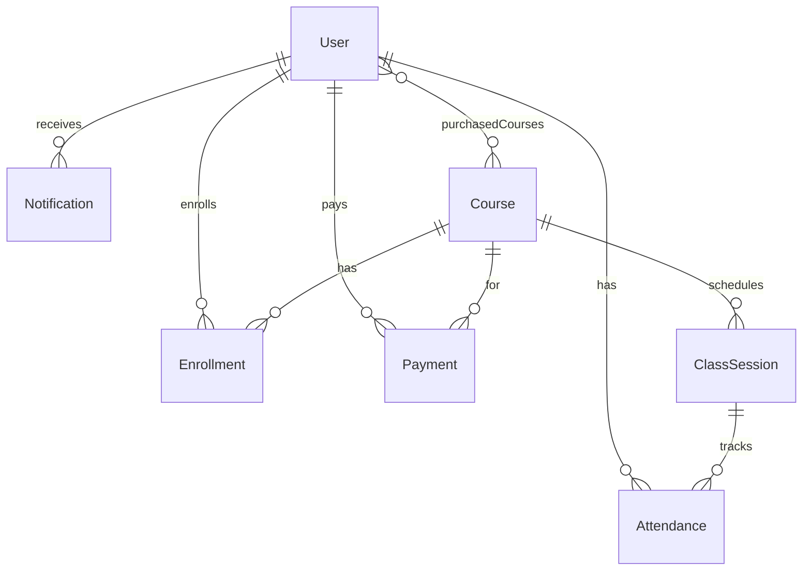

# Yogshala Backend Architecture — LLM Context Document

Use this document as system/context when prompting an LLM to build features on this codebase.

---

## 1. What This Project Is

**Yogshala** is a **Yoga Course LMS** (Learning Management System): students browse courses, pay via Razorpay, get enrolled, and attend scheduled live classes. Admins create courses, manage users, view payments/enrollments, and schedule class sessions.

**Domain scope today:** Courses + Enrollments + Payments + Class Sessions only.

**Recently removed:** The entire **Workshops** feature was deleted — models, services, repositories, validations, and all `/api/workshops/*` routes. Do **not** assume workshops exist.

---

## 2. Tech Stack

| Layer | Technology |
|--------|------------|
| Framework | Next.js **16** (App Router, API Routes in `src/app/api/`) |
| Language | TypeScript 5 |
| Database | MongoDB Atlas via **Mongoose 9** |
| Auth | **Auth.js v5** (NextAuth beta), JWT sessions, Google OAuth + Credentials |
| Payments | **Razorpay** (orders, signature verify, webhooks) |
| Media | **Cloudinary** (images + videos) |
| Validation | **Zod 4** |
| Password | bcryptjs (12 salt rounds) |

There is **no separate Express/Fastify server** — backend is Next.js Route Handlers only.

---

## 3. Architecture Pattern (Mandatory Convention)

Every feature should follow this layered flow:

```
Request
  → src/proxy.ts          (edge route protection — NOT business logic)
  → src/app/api/**/route.ts   (HTTP handler)
  → middleware/           (withAuth, withAdmin, validateBody/validateQuery)
  → services/             (business logic)
  → repositories/         (DB queries only)
  → models/               (Mongoose schemas)
  → MongoDB
```

### Key utilities

| File | Purpose |
|------|---------|
| `src/utils/asyncHandler.ts` | Wraps route handlers in try/catch |
| `src/utils/apiResponse.ts` | Standard `{ success, message, data?, errors? }` responses |
| `src/middleware/errorHandler.ts` | Central error formatting (Zod, Mongoose) |
| `src/constants/index.ts` | Enums: roles, payment status, batch type, etc. |
| `src/types/index.ts` | Shared TypeScript interfaces |
| `src/validations/*.validation.ts` | Zod schemas per domain |

### Standard API response shape

```json
{
  "success": true,
  "message": "Human-readable message",
  "data": { },
  "pagination": {
    "page": 1,
    "limit": 10,
    "total": 0,
    "totalPages": 0,
    "hasNextPage": false,
    "hasPrevPage": false
  }
}
```

Errors use `success: false` + HTTP status codes from `HTTP_STATUS` in constants.

### Route handler pattern

```typescript
export const GET = asyncHandler(
  withAuth(async (req, { user, params }) => {
    const validation = validateQuery(req, someSchema);
    if (validation.error) return validation.error;
    const result = await SomeService.doThing(user.id, validation.data);
    return sendSuccess(result, "Done");
  })
);
```

---

## 4. Auth & Authorization

### Session model

- **JWT strategy** (7-day max age), HTTP-only cookie via Auth.js
- Custom JWT fields: `id`, `role`, `profileCompleted`
- Two roles: `student` | `admin` (`UserRole` enum)

### Auth config split (important)

- `src/config/auth.config.ts` — Edge-compatible (used by `proxy.ts`)
- `src/config/auth.ts` — Full Node config with DB-backed Credentials authorize + Google user creation

### Middleware wrappers

- `withAuth` — requires logged-in user, passes `SessionUser`
- `withAdmin` — requires `role === "admin"`

### Edge protection (`src/proxy.ts`)

Replaces deprecated `middleware.ts` in Next.js 16.

Protects:

- Frontend: `/dashboard/*`, `/admin/*` (redirects to `/login`)
- API: `/api/enrollments/*`, `/api/admin/*`, some `/api/auth/*`
- Role redirects: admin ↔ student dashboard separation
- Also matches `/api/classes/*` and `/api/payments/*` but **does not block unauthenticated access there** — those routes use `withAuth`/`withAdmin` internally

### Profile gate for payments

`PaymentService.createOrder` checks `AuthService.isProfileComplete(userId)`. Google OAuth users must call `/api/auth/complete-profile` first.

### Password reset

Token is generated and stored in DB, but **no email service exists**. In dev, token is returned in API response; in prod, a generic success message is returned without sending email.

---

## 5. Data Models (MongoDB / Mongoose)

All models exported from `src/models/index.ts`.

### Entity relationships



### Models detail

| Model | File | Key fields |
|-------|------|------------|
| **User** | `User.model.ts` | name, email, phone, password (select:false), role, authProvider, profileCompleted, purchasedCourses[], status (active/blocked/suspended), resetPasswordToken |
| **Course** | `Course.model.ts` | title, slug, description, pricing (price/discountPrice), batchType, dates, curriculum (sections/lessons — metadata only), instructor subdoc, media (thumbnail/gallery/introVideo via Cloudinary), SEO, isPublished |
| **Enrollment** | `Enrollment.model.ts` | student, course, progressPercentage, paymentStatus, completed, enrolledAt |
| **Payment** | `Payment.model.ts` | user, **course** (course-only, no polymorphic product type), razorpay fields, idempotencyKey, internalOrderId, paymentExpiry, checkoutPayload |
| **ClassSession** | `ClassSession.model.ts` | course, title, meetingLink, scheduledDate, startTime, endTime, status (upcoming/completed/cancelled) |
| **Attendance** | `Attendance.model.ts` | student, classSession, attended |
| **Notification** | `Notification.model.ts` | user, title, message, isRead |

**Note:** Curriculum lessons are **metadata only** — there is no video streaming, lesson completion tracking, or DRM system.

---

## 6. Existing API Endpoints (Implemented)

### Auth — `src/app/api/auth/`

| Method | Path | Auth | Notes |
|--------|------|------|-------|
| POST | `/api/auth/register` | Public | Manual signup |
| POST | `/api/auth/login` | Public | Credentials login |
| POST | `/api/auth/logout` | Required | |
| GET | `/api/auth/me` | Required | Current user profile |
| POST | `/api/auth/complete-profile` | Required | Google users: phone + password |
| POST | `/api/auth/update-profile` | Required | Update name, phone, bio, etc. |
| POST | `/api/auth/change-password` | Required | |
| POST | `/api/auth/forgot-password` | Public | No real email sent |
| POST | `/api/auth/reset-password` | Public | Token-based reset |
| GET/POST | `/api/auth/[...nextauth]` | — | Auth.js handler |

### Courses — `src/app/api/courses/`

| Method | Path | Auth | Notes |
|--------|------|------|-------|
| GET | `/api/courses` | Public | Paginated, filterable; defaults `isPublished=true` |
| POST | `/api/courses` | Admin | Create course |
| GET | `/api/courses/:id` | Public | Accepts MongoDB ObjectId **or slug** |
| PUT | `/api/courses/:id` | Admin | Update |
| DELETE | `/api/courses/:id` | Admin | Deletes Cloudinary media first |
| POST | `/api/courses/:id/media` | Admin | Upload/replace thumbnail, video, gallery |
| DELETE | `/api/courses/:id/media` | Admin | Remove gallery item only |

### Payments — `src/app/api/payments/`

| Method | Path | Auth | Notes |
|--------|------|------|-------|
| POST | `/api/payments/create-order` | Required | Requires `Idempotency-Key` header; creates Razorpay order for **courseId** |
| POST | `/api/payments/verify` | Required | HMAC signature verify → creates enrollment |
| POST | `/api/payments/webhook` | Webhook sig | Handles `payment.captured` / `payment.failed` |

Payment flow on success: update Payment → create Enrollment → add course to `user.purchasedCourses` → create Notification (verify path only).

### Enrollments — `src/app/api/enrollments/`

| Method | Path | Auth | Notes |
|--------|------|------|-------|
| GET | `/api/enrollments/my-courses` | Required | Paginated enrolled courses |
| GET | `/api/enrollments/:id` | Required | Single enrollment (ownership check) |

### Class Sessions — `src/app/api/classes/`

| Method | Path | Auth | Notes |
|--------|------|------|-------|
| GET | `/api/classes` | Required | Students: enrolled courses only; Admin: all |
| POST | `/api/classes` | Admin | Create session |
| PUT | `/api/classes/:id` | Admin | Update |
| DELETE | `/api/classes/:id` | Admin | Delete |
| GET | `/api/classes/course/:courseId` | Required | Paginated sessions for a course |

### Admin — `src/app/api/admin/`

| Method | Path | Auth | Notes |
|--------|------|------|-------|
| GET | `/api/admin/dashboard` | Admin | Stats: users, courses, enrollments, revenue, recent payments |
| GET | `/api/admin/users` | Admin | Paginated + search + role filter |
| PATCH | `/api/admin/users/:id/role` | Admin | Promote/demote (safety: can't demote last admin or self) |
| GET | `/api/admin/payments` | Admin | Paginated |
| GET | `/api/admin/enrollments` | Admin | Paginated |

### Other

| Method | Path | Auth | Notes |
|--------|------|------|-------|
| POST | `/api/upload` | Admin | Pre-course Cloudinary upload (before course doc exists) |
| GET | `/api/health` | Public | DB health check |

---

## 7. Services & Repositories (Full Layer Map)

### Fully wired (service + repo + API)

| Domain | Service | Repository |
|--------|---------|------------|
| Auth | `auth.service.ts` | `user.repository.ts` |
| Courses | `course.service.ts` | `course.repository.ts` |
| Payments | `payment.service.ts` | `payment.repository.ts` |
| Enrollments | `enrollment.service.ts` | `enrollment.repository.ts` |
| Class Sessions | `classSession.service.ts` | `classSession.repository.ts` |
| Admin | `admin.service.ts` | Uses multiple repos |

### Partially wired (service + repo exist, **NO API routes**)

| Domain | Service | Repository | What's missing |
|--------|---------|------------|----------------|
| **Notifications** | `notification.service.ts` | `notification.repository.ts` | No `/api/notifications/*`. Only created internally on payment verify. Frontend notifications page uses **mock data**. |
| **Attendance** | `attendance.service.ts` | `attendance.repository.ts` | No `/api/attendance/*`. No admin mark-attendance UI wired to backend. |

### Service methods without API exposure

- `EnrollmentService.updateProgress()` — progress field exists on model, displayed in dashboard, but **no PATCH endpoint** to update it
- No manual admin enrollment creation
- No user block/suspend admin API (enum exists on User model)

---

## 8. What Does NOT Exist (Gaps for New Features)

| Feature | Status |
|---------|--------|
| Workshops | **Removed** — do not reference |
| Email service (SendGrid/Resend/Nodemailer) | Not implemented |
| Notifications API | Model + service only |
| Attendance API | Model + service only |
| Enrollment progress update API | Service method only |
| Refunds | `PaymentStatus.REFUNDED` enum only, no flow |
| User block/suspend admin actions | Status field exists, no API |
| Analytics backend | Admin page is placeholder ("under construction") |
| Course slug redirect route | `src/app/[slug]/route.ts` is a stub returning `{ message }` |
| Lesson video delivery / progress per lesson | Curriculum is display metadata only |
| Instructor as separate entity | Embedded subdocument on Course |
| Tests | None |
| Rate limiting | None |
| `.env.example` | Referenced in README but file not in repo |
| Separate REST versioning | All routes are `/api/...` flat |

---

## 9. External Integrations

### Razorpay (`src/config/razorpay.ts`)

Env: `RAZORPAY_KEY_ID`, `RAZORPAY_KEY_SECRET`, `RAZORPAY_WEBHOOK_SECRET`

Features: idempotent order creation, 15-min checkout expiry, signature verification, webhook fallback enrollment.

### Cloudinary (`src/config/cloudinary.ts`, `src/utils/media.ts`)

Env: `CLOUDINARY_CLOUD_NAME`, `CLOUDINARY_API_KEY`, `CLOUDINARY_API_SECRET`

Upload paths: `courses/thumbnails`, `courses/videos`, `courses/gallery`

### MongoDB (`src/config/database.ts`)

Env: `MONGODB_URI` — singleton cached connection pattern.

### Auth env vars

`AUTH_SECRET`, `AUTH_URL`, `AUTH_TRUST_HOST`, `AUTH_GOOGLE_ID`, `AUTH_GOOGLE_SECRET`

Optional: `PAYMENT_ORDER_EXPIRY_MINS` (default 15)

---

## 10. Enums & Business Rules

```typescript
UserRole: "student" | "admin"
UserStatus: "active" | "blocked" | "suspended"
AuthProvider: "manual" | "google"
BatchType: "morning" | "afternoon" | "evening"
MeetingPlatform: "zoom" | "google-meet" | "teams" | "other"
PaymentStatus: "pending" | "paid" | "failed" | "refunded"
ClassStatus: "upcoming" | "completed" | "cancelled"
DEFAULT_CURRENCY: "INR"
```

Key business rules:

- Public course listing only shows `isPublished: true` by default
- Duplicate enrollment blocked if already paid
- Payment requires complete profile
- Course delete cleans up Cloudinary assets
- Admin cannot change own role or demote last admin

---

## 11. How to Add a New Backend Feature (Prompt Template)

When asking an LLM to build a feature, include:

```
Project: Yogshala LMS (Next.js 16 App Router + MongoDB + Auth.js + Razorpay)

Architecture: API Route → withAuth/withAdmin → validateBody(Zod) → Service → Repository → Model

Follow existing patterns in:
- Route: src/app/api/<domain>/route.ts
- Validation: src/validations/<domain>.validation.ts
- Service: src/services/<domain>.service.ts (static class methods)
- Repository: src/repositories/<domain>.repository.ts (static class, calls connectToDatabase())
- Model: src/models/<Domain>.model.ts
- Types: src/types/index.ts
- Export model from src/models/index.ts

Use asyncHandler wrapper, sendSuccess/sendPaginated/sendCreated for responses.
Add route to proxy.ts matcher if auth protection needed at edge.

Existing related code: [paste relevant service/repo if extending]
Gap to fill: [specific missing API or logic]
Do NOT add workshops — that feature was removed.
```

---

## 12. Frontend ↔ Backend Wiring

| Frontend page | API used |
|---------------|----------|
| Public courses list | `GET /api/courses` |
| Course showcase/checkout | `GET /api/courses/:id`, payment APIs |
| Student dashboard | `GET /api/enrollments/my-courses`, `GET /api/classes` |
| My courses | `GET /api/enrollments/my-courses` |
| Settings | `GET /api/auth/me`, `POST /api/auth/update-profile`, `POST /api/auth/change-password` |
| Admin dashboard | `GET /api/admin/dashboard` |
| Admin courses CRUD | `/api/courses/*`, `/api/upload`, `/api/courses/:id/media` |
| Admin users | `GET /api/admin/users`, `PATCH /api/admin/users/:id/role` |
| Notifications page | **Mock data only** — no API |
| Admin analytics | **Placeholder UI** — no API |

---

## 13. One-Paragraph Summary

Yogshala is a Next.js 16 monolith with a clean **Route → Middleware → Service → Repository → Mongoose** backend for a yoga course LMS. Auth is Auth.js v5 (JWT + Google OAuth). Payments are Razorpay course purchases only. Core domains are Users, Courses (rich builder with Cloudinary media), Enrollments, Payments, ClassSessions. Notifications and Attendance have full service/repository layers but **no REST APIs yet**. Workshops were removed. Missing: email, refunds, progress update API, analytics backend, and real notification delivery. All APIs return `{ success, message, data }` and validate with Zod 4.
